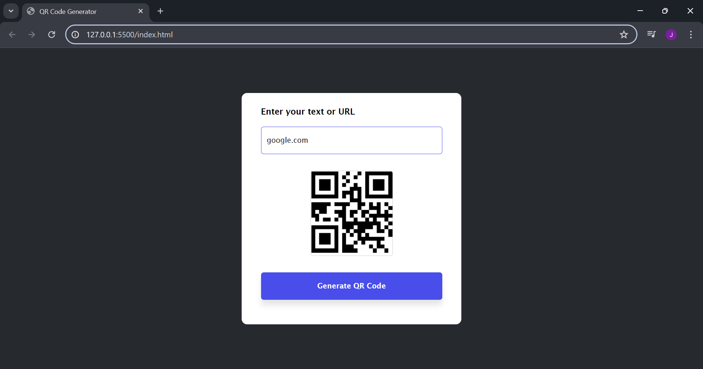

# **QR Code Generator Website**

A **simple and responsive QR Code Generator** built using **HTML**, **CSS**, and **JavaScript**. This app uses the **Free QR Code Generator API** to create a **QR code** for any **text** or **URL** entered by the user. You will get the **QR code in image format** instantly!

## Live Demo
**[Click here to view the project](https://USERNAME.github.io/qr-code-generator/)**  

## API Used
I used the **Free QR Code Generator API** to generate QR codes:  
[QR code generator web API at api.qrserver.com](https://api.qrserver.com/v1/create-qr-code/?size=150x150&data=Example)

**Example API Request**:  
https://api.qrserver.com/v1/create-qr-code/?size=150x150&data=HelloWorld

**Example API Response**:  
You get a **QR Code image** back:  

## Tech Stack
- **HTML5**  
- **CSS3**
- **JavaScript** 
- **Free QR Code Generator API**  

## Features
- Generate **QR Code** from any **text** or **link**  
- Uses **Free QR Code API** for instant QR generation  
- Get QR **in image format**  
- Responsive and **easy-to-use** design

## Screenshots

## Connect with Me
- 
- 
- 
